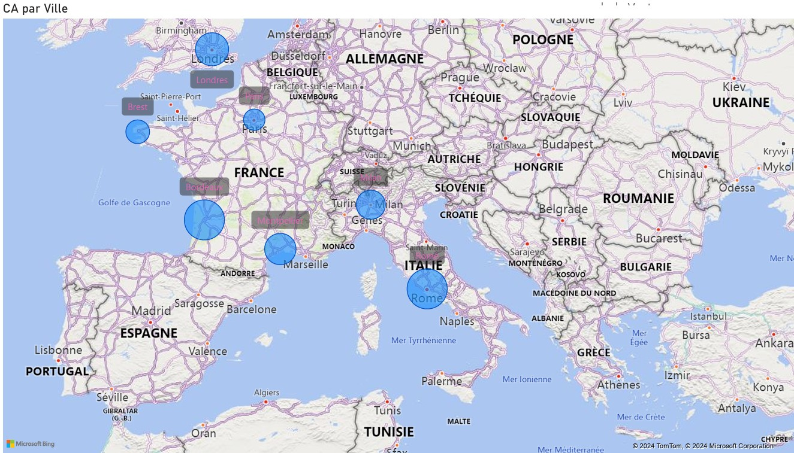

# Power-BI

### Objectifs :

1. Construire d'un uml
2. Préparation des données.
3.Construction du rapport.

***

### Vous trouverez :

* [Lien vers l'export PDF](https://github.com/Razan-ALTUJJAR/Power-BI/blob/main/ANALYSE%20des%20ventes.pdf)  

